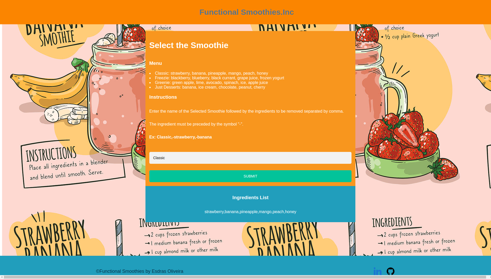

# functional-smooothies-inc

## Sumário

- [Descrição](#Descrição)
- [Pré-requisitos](#Pre-requisitos)
  - [Instalação](#Instalação)
  - [Instruções para iniciar o projeto](#Intruções-para-iniciar-o-projeto)
- [Documentação](#Documentação)
  - [Listar Ingredients](#Listar-Ingredients)


<br>

## Descrição

**Objetivo**: Neste projeto foi desenvolvido uma aplicação completa com frontend em javascript e React.js, um backend em Java e SpringBoot. Essa aplicação simula um site de pedidos de Smoothies.

- React.js;
- Arquitetura REST;
- Conseitos de SOLID e POO;
- Java 11 e Javascript;
- Docker;

## Pré-requisitos

- `npm version 6.14.13`
- `node version 14.17.0`
- `openjdk 11.0.16`
- `docker version 20.10.13`
- `docker-compose version 1.29.2`

## Instalação

- Clone o repositório
  ```sh
    git clone git@github.com:esdrasoliveira5/functional-smooothies-inc.git
- Vá para a pasta da aplicação
  ```sh
    cd functional-smooothies-inc

## Instruções para iniciar o projeto

<br>

- Comando para iniciar

  ```sh
  sudo docker-compose up


- Acesse a aplicacao web pela rota

  ```sh
  http://localhost:5173/


- Acesse o backend pela rota

  ```sh
  http://localhost:8080/


<br/>



## Documentação

<br/>

### **Listar Ingredients** 
##### `POST` /ingredients/create
  <br/>

  Esse endpoint retorna uma lista de ingredientes.

  - Exemplo `request body` 
    ``` json
    {
        "ingredient": "Classic"
    }
    ```

  - Exemplo `response body`
    ```json
      {
          "ingredient": "strawberry,banana,pineapple,mango,peach,honey"
      }
    ```
  <br/>

### **Listar Ingredients sem ingredient especifico** 
##### `POST` /ingredients/create
  <br/>

  Esse endpoint retorna uma lista de ingredientes.

  - Exemplo `request body` 
    ``` json
    {
        "ingredient": "Classic, -strawberry,-banana"
    }
    ```

  - Exemplo `response body`
    ```json
      {
          "ingredient": "pineapple,mango,peach,honey"
      }
    ```
  <br/>
